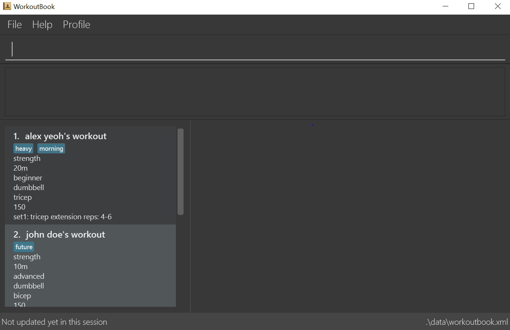

= Workout Tracker
ifdef::env-github,env-browser[:relfileprefix: docs/]

https://travis-ci.org/CS2113-AY1819S1-T13-5/main[image:https://travis-ci.org/CS2113-AY1819S1-T13-5/main.svg?branch=master[Build Status]]
https://ci.appveyor.com/project/damithc/addressbook-level4[image:https://ci.appveyor.com/api/projects/status/3boko2x2vr5cc3w2?svg=true[Build status]]
https://coveralls.io/github/se-edu/addressbook-level4?branch=master[image:https://coveralls.io/repos/github/se-edu/addressbook-level4/badge.svg?branch=master[Coverage Status]]
https://www.codacy.com/app/damith/addressbook-level4?utm_source=github.com&utm_medium=referral&utm_content=se-edu/addressbook-level4&utm_campaign=Badge_Grade[image:https://api.codacy.com/project/badge/Grade/fc0b7775cf7f4fdeaf08776f3d8e364a[Codacy Badge]]
https://gitter.im/se-edu/Lobby[image:https://badges.gitter.im/se-edu/Lobby.svg[Gitter chat]]

ifdef::env-github[]

endif::[]

ifndef::env-github[]
image::images/Ui.png[width="600"]
endif::[]

* Hoping to get started on that workout regime you always kept on the back burner? But wait, what's that other attractive workout you just read about?

* If you have too many workouts to choose from or wish to keep, then this *Workout Tracker* is for you!

* It is a CLI (Command Line Interface) application, so you can save time using your keyboard instead of your mouse to nagivate.
* Features of Workout Tracker:
** A convenient GUI to easily manage your workouts
** Keep track of future, present and past workouts in a user-friendly way!
** A detailed Progress Tracker of each workout
** Notifications to keep you reminded consistently!

== Site Map

* <<UserGuide#, User Guide>>
* <<DeveloperGuide#, Developer Guide>>
* <<LearningOutcomes#, Learning Outcomes>>
* <<AboutUs#, About Us>>
* <<ContactUs#, Contact Us>>

== Acknowledgements

* Workout Tracker was built on AddressBook-Level4 project created by SE-EDU initiative at https://github.com/se-edu/
* Some parts of this sample application were inspired by the excellent http://code.makery.ch/library/javafx-8-tutorial/[Java FX tutorial] by
_Marco Jakob_.
* Libraries used: https://github.com/TestFX/TestFX[TextFX], https://bitbucket.org/controlsfx/controlsfx/[ControlsFX], https://github.com/FasterXML/jackson[Jackson], https://github.com/google/guava[Guava], https://github.com/junit-team/junit5[JUnit5]

== Licence : link:LICENSE[MIT]

