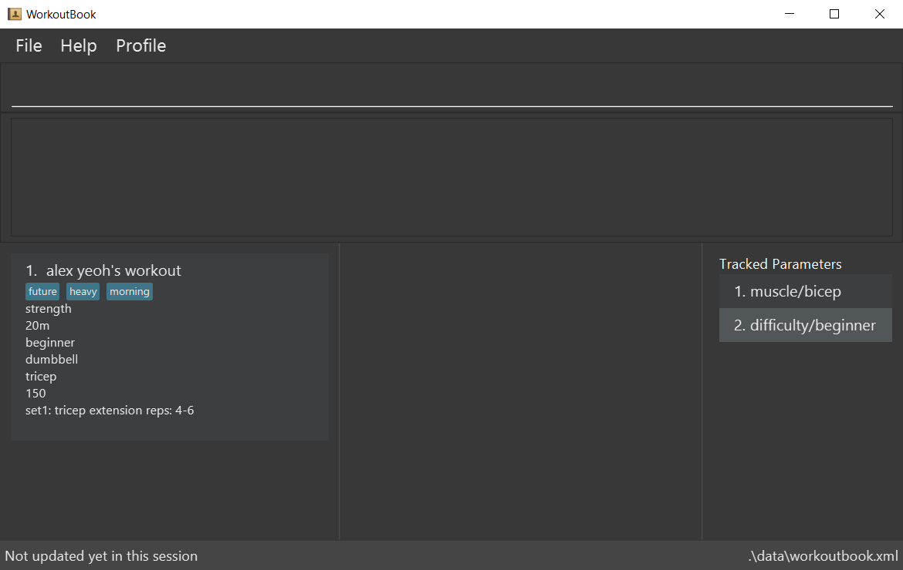

= WorkoutBook
ifdef::env-github,env-browser[:relfileprefix: docs/]

https://travis-ci.org/CS2113-AY1819S1-T13-5/main[image:https://travis-ci.org/CS2113-AY1819S1-T13-5/main.svg?branch=master[Build Status]]
https://coveralls.io/github/CS2113-AY1819S1-T13-5/main?branch=master[image:https://coveralls.io/repos/github/CS2113-AY1819S1-T13-5/main/badge.svg?branch=master[Coverage Status]]

ifdef::env-github[]

endif::[]

ifndef::env-github[]
image::images/Ui.png[width="600"]
endif::[]

* Hoping to get started on that workout regime you always kept on the back burner? But wait, what's that other attractive workout you just read about?

* If you have too many workouts to choose from or wish to keep, then this *WorkoutBook* is for you!

* It is a CLI (Command Line Interface) application, so you can save time using your keyboard instead of your mouse to nagivate.
* Features of WorkoutBook:
** A convenient GUI to easily manage your workouts
** Keep track of future, present and past workouts in a user-friendly way!
** A detailed Progress Tracker of each workout
** A user profile that can be used to set your workout presets!

== Site Map

* <<UserGuide#, User Guide>>
* <<DeveloperGuide#, Developer Guide>>
* <<AboutUs#, About Us>>
* <<ContactUs#, Contact Us>>

== Acknowledgements

* WorkoutBook was built on AddressBook-Level4 project created by SE-EDU initiative at https://github.com/se-edu/
* Some parts of this sample application were inspired by the excellent http://code.makery.ch/library/javafx-8-tutorial/[Java FX tutorial] by
_Marco Jakob_.
* Libraries used: https://github.com/TestFX/TestFX[TextFX], https://bitbucket.org/controlsfx/controlsfx/[ControlsFX], https://github.com/FasterXML/jackson[Jackson], https://github.com/google/guava[Guava], https://github.com/junit-team/junit5[JUnit5], https://jsoup.org/[jsoup], https://commons.apache.org/proper/commons-io/[commons.io 2.6]

== Licence : link:LICENSE[MIT]

